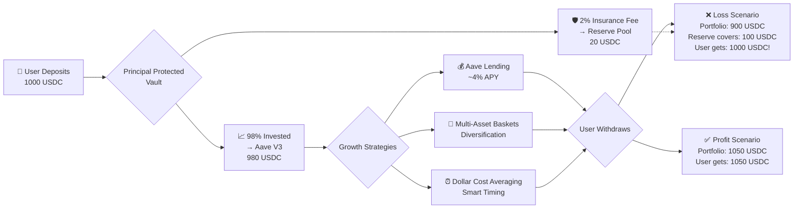

<div align="center">

# 🛡️ Principal Protected Vault

### Never Lose Your Principal. Always Grow Your Wealth.

[](https://base.org)
[](https://soliditylang.org)
[](https://aave.com)
[](https://eips.ethereum.org/EIPS/eip-2535)

---

> *"Deposit your money. We grow it. You withdraw anytime with zero loss guarantee."*

</div>

---

## 🎯 The Problem

**People are afraid to invest in crypto because they might lose their money.**

This fear stops millions from building wealth on-chain, even though:
- 📈 Long-term crypto holders make significant returns
- 💰 DeFi yields beat traditional finance
- 🌍 Crypto is accessible to anyone, anywhere

**The missing piece? Principal protection.**

---

## 💡 Our Solution

A **self-custodial vault** where:

1. ✅ You deposit USDC with a small 2% insurance fee
2. ✅ We grow your money using battle-tested DeFi strategies
3. ✅ You withdraw **anytime** and get **at least your principal back**
4. ✅ If returns are negative, our reserve pool covers the loss

### The Promise

```
Your principal is GUARANTEED.
Your upside is UNLIMITED.
```

---

## 🔄 How It Works



### User Experience (Simple)

1. **Deposit** → Transfer USDC to vault
2. **Relax** → We handle everything (Aave, diversification, timing)
3. **Withdraw** → Get your money back anytime, **principal guaranteed**

### Under the Hood (What We Do)

- 💵 **Aave V3 Integration** — Earn yield from lending markets
- 🌺 **Garden Baskets** — Diversify across multiple assets
- ⏰ **DCA Strategies** — Buy assets gradually to reduce volatility
- 🛡️ **Reserve Insurance Pool** — Automatically covers any losses

> **Users don't need to understand DeFi — they just need to trust the guarantee.**

---

## 📊 Live Proof: Real Tests on Base Mainnet

All tests run on **live Base mainnet fork** with real Aave V3 positions.

### Key Test: Principal Protection in Action

```bash
forge test --match-test testFullPrincipalProtectionFlow --fork-url https://mainnet.base.org -vv
```

**Test Output:**

```
=== Principal Protected Vault Full Flow Test ===

1. Reserve funded:       500 USDC
2. User deposited:       1000 USDC
   Principal recorded:   1000 USDC
   Reserve balance:      520 USDC (500 + 2% fee)

3. After 30 days...
   Portfolio value:      982 USDC (small loss from market)

4. User withdraws:
   ✅ Reserve covers shortfall: 18 USDC
   ✅ User receives: 1000 USDC (full principal!)
   ✅ Reserve after: 502 USDC

🎉 TEST PASSED: PRINCIPAL PROTECTED!
```

### Full Test Suite Results

```
✅ 14 tests passed | 0 failed
━━━━━━━━━━━━━━━━━━━━━━━━━━━━━━━━━━━━━━━━━━━━━

Core Tests:
✅ testDeposit                        (gas: 418,712)
✅ testDepositCreatesAavePosition     (gas: 434,873)
✅ testWithdrawWithProfit             (gas: 442,918)
✅ testWithdrawWithLossUsesReserve    (gas: 475,550)
✅ testFullPrincipalProtectionFlow    (gas: 516,568)
✅ testMultipleUsersDeposit           (gas: 564,468)

Reserve Tests:
✅ testFundReserve                    (gas: 121,356)
✅ testAnyoneCanFundReserve           (gas: 121,379)

Security Tests:
✅ testCannotDepositTwice             (gas: 429,757)
✅ testCannotWithdrawWithoutDeposit   (gas: 42,663)
✅ testOnlyOwnerCanSetDepositToken    (gas: 18,704)
```

> All tests verify the vault works with **real Aave V3 on Base**, not mocks.

---

## 🏗️ Technical Architecture

### Smart Contract Structure

```
src/facets/utilityFacets/ppv/
├── PPVFacet.sol         # Main vault logic
├── PPVStorage.sol       # Diamond storage pattern
└── IPPV.sol             # Interface

Supporting Strategies (Pluggable):
├── aaveV3/              # Aave lending integration
├── garden/              # Multi-asset diversification
└── dca/                 # Dollar cost averaging
```

### Key Design Decisions

| Feature | Implementation | Why |
|---------|----------------|-----|
| **Diamond Standard (EIP-2535)** | Upgradeable modular architecture | Add new strategies without redeploying |
| **Aave V3 Integration** | Native lending protocol on Base | Battle-tested, ~4% APY, high liquidity |
| **Insurance Reserve** | 2% fee + owner funding | Sustainable protection mechanism |
| **Self-Custodial** | Users always own their funds | No trusted intermediary |

---

## 🔐 Security Features

| Protection | How We Do It |
|------------|-------------|
| 🛡️ **Principal Guarantee** | Reserve pool automatically covers losses |
| 🔒 **Self-Custodial** | Users retain full ownership via Diamond proxy |
| ⏰ **Withdraw Anytime** | No lock periods, instant liquidity |
| 💰 **Reserve Transparency** | On-chain tracking of reserve health |
| 🏦 **Aave V3 Safety** | Audited protocol with $10B+ TVL |

---

## 🚀 How to Run & Test

### Prerequisites

- [Foundry](https://book.getfoundry.sh/getting-started/installation)
- Base RPC URL (mainnet or testnet)

### Install & Test

```bash
# Clone repository
git clone <your-repo>
cd Blokathon-Foundry

# Install dependencies
forge install

# Run PPV tests on Base mainnet fork
forge test --match-contract PPVFacetTest \
    --fork-url https://mainnet.base.org -vv

# Run specific test
forge test --match-test testFullPrincipalProtectionFlow \
    --fork-url https://mainnet.base.org -vvv
```

### Deploy to Base

```bash
# Set environment variables
export PRIVATE_KEY="your_key"
export RPC_URL_BASE="https://mainnet.base.org"

# Deploy Diamond + PPV Facet
forge script script/Deploy.s.sol \
    --rpc-url $RPC_URL_BASE \
    --private-key $PRIVATE_KEY \
    --broadcast
```

---

## 📈 Why This Matters for BLOK

<div align="center">

### BLOK's Mission: **Democratize Wealth Building**

</div>

Our vault directly supports this by removing the **#1 barrier** to crypto investing:

| Barrier | Traditional Finance | Crypto (Before) | Our Solution |
|---------|-------------------|-----------------|--------------|
| **Fear of Loss** | FDIC insurance ($250k) | Nothing | Principal guarantee |
| **Complexity** | "Set it and forget it" funds | Need to understand DeFi | Just deposit USDC |
| **Custody Risk** | Bank holds your money | Smart contract risk | Self-custodial + Aave safety |
| **Access** | Need bank account | Need wallet | ✅ Already have wallet! |

### The Impact

> **Anyone with a wallet can build wealth on-chain with ZERO fear of losing their deposit.**

This unlocks crypto investing for:
- 😰 Risk-averse investors who want upside without downside
- 👵 Elderly people who need capital preservation
- 🌍 People in unstable economies seeking dollar safety
- 💼 Professionals who want "set it and forget it" wealth

---

## 🎯 Future Roadmap

The Diamond architecture makes adding new strategies trivial:

- [ ] **Multiple Vaults** — Different risk/reward profiles
- [ ] **Yield Optimization** — Auto-route to highest APY
- [ ] **Multi-Chain** — Expand beyond Base
- [ ] **Fiat On-Ramp** — Direct bank → vault deposits
- [ ] **Mobile App** — Consumer-friendly interface

---

## 📚 Learn More

- **EIP-2535 Diamond Standard**: [https://eips.ethereum.org/EIPS/eip-2535](https://eips.ethereum.org/EIPS/eip-2535)
- **Aave V3 on Base**: [https://app.aave.com](https://app.aave.com)
- **Base Network**: [https://base.org](https://base.org)

---

<div align="center">

## 🏆 Built for Blok-a-Thon Hackathon

**Making wealth building safe, accessible, and unstoppable on Base.**

---

**Made with ❤️ using Foundry, Solidity, Aave V3, and the Diamond Standard**

[📄 Documentation](#) • [🐛 Report Bug](#) • [✨ Request Feature](#)

</div>
