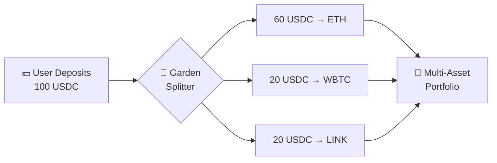
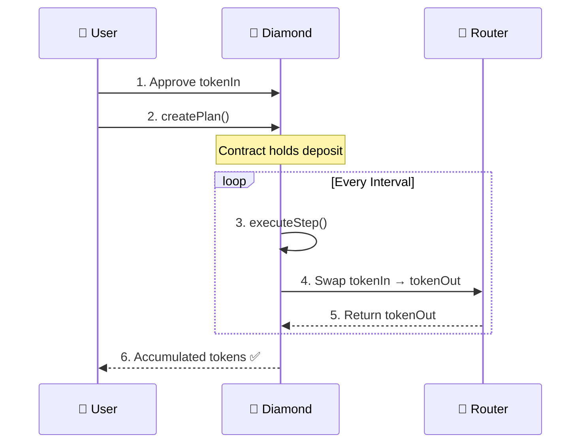
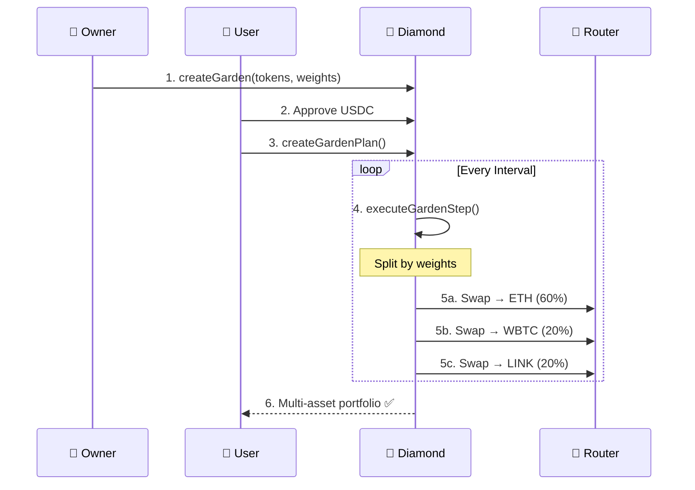

<div align="center">

# 🌱 Diamond DCA + Garden Investing

### A modular, upgradeable, self-custodial wealth engine built using EIP-2535

[](https://base.org)
[](https://soliditylang.org)
[](https://eips.ethereum.org/EIPS/eip-2535)
[](https://opensource.org/licenses/MIT)

---

> *"Deposit once. Accumulate over time.*  
> *No market timing. No emotional trading.*  
> *Wealth tools, not degen tools."*

</div>

---

## 📋 Table of Contents

- [Overview](#-overview)
- [The Problem We Solve](#-the-problem-we-solve)
- [What is DCA?](#-what-is-dca)
- [What is a Garden?](#-what-is-a-garden)
- [User Flows](#-user-flows)
- [Core Contracts](#-core-contracts)
- [Security](#-security--safety)
- [Testing](#-testing)
- [Why This Matters](#-why-this-matters)

---

## 🚀 Overview

This facet extends a Diamond-based smart contract to support **automatic Dollar Cost Averaging (DCA)** and **curated multi-asset baskets ("Gardens")**, enabling anyone to invest on-chain with zero complexity.

Built for the **Blok-a-Thon hackathon** on Base.

---

## 🎯 The Problem We Solve

Most people don't lose money in crypto because of bad tokens.

They lose because they:
- 📈 Buy at the wrong time
- 😰 Panic sell
- 🎰 Chase pumps  
- 🚫 Have no investment system

### ✨ Our Solution

| Feature | Description |
|---------|-------------|
| ✅ **Deposit Once** | Set it and forget it |
| ✅ **Auto-Buy Periodically** | Contract handles the timing |
| ✅ **No Market Timing** | Remove emotional decisions |
| ✅ **No Bots Required** | Fully on-chain execution |
| ✅ **Self-Custodial** | You control your funds |
| ✅ **Beginner Friendly** | "Even grandma can invest" UX |

---

## 💡 What is DCA?

**Dollar Cost Averaging** = buying an asset gradually instead of all at once.

```
📊 Month 1: Buy $100 of ETH at $2000 → 0.05 ETH
📊 Month 2: Buy $100 of ETH at $1800 → 0.055 ETH  
📊 Month 3: Buy $100 of ETH at $2200 → 0.045 ETH
━━━━━━━━━━━━━━━━━━━━━━━━━━━━━━━━━━━━━━━━
💰 Total: $300 invested → 0.15 ETH (avg $2000/ETH)
```

### Why DCA Works

| Benefit | Impact |
|---------|--------|
| 🎯 Reduces timing risk | Buy consistently, not emotionally |
| 📉 Smooths volatility | Average out the ups and downs |
| 🧘 Prevents panic trading | System removes emotions |
| 📈 Builds positions | Automatic long-term accumulation |

> **Note:** DCA only makes sense when converting assets:  
> `Stablecoins → ETH/BTC` or `USDC → Diversified Basket`

---

## 🌺 What is a Garden?

A **Garden** is a curated, index-like basket of multiple tokens.

### Example Garden: "Blue Chip Basket"

| Asset | Weight |
|-------|--------|
| ETH   | 60%    |
| WBTC  | 20%    |
| LINK  | 20%    |

### How It Works



### Key Features

- 📊 **Each DCA step splits deposits** across assets based on weights
- ✂️ **Curators can "prune"** bad assets and update weights
- 🔐 **Users remain fully self-custodial** at all times
- 🔄 **Dynamic updates** — next steps use the latest configuration

> *Think of it like* ***NIFTY50*** *but on-chain.*  
> *A curated, evolving basket that grows over time.*

---

## 🔄 User Flows

### Flow 1: DCA Into a Single Asset



### Flow 2: DCA Into a Garden (Multi-Asset)



---

## 📦 Core Contracts

### `DCAFacet.sol`

Handles single-asset DCA logic:

```solidity
// Core Functions
function createPlan(...)    // Create a new DCA plan
function executeStep(...)   // Execute next DCA step
function cancelPlan(...)    // Cancel and withdraw remaining
```

### `GardenFacet.sol`

Manages multi-asset baskets:

```solidity
// Core Functions  
function createGarden(...)  // Create a new basket
function updateWeights(...) // Adjust allocations
function pruneAsset(...)    // Remove underperforming asset
```

### `GardenDCAFacet.sol`

DCA into Gardens:

```solidity
// Core Functions
function createGardenPlan(...)    // DCA into a basket
function executeGardenStep(...)   // Execute multi-swap step
```

### Storage Contracts

| Contract | Purpose |
|----------|---------|
| `DCAFacetStorage.sol` | Stores DCA plan data |
---

## 🧪 Testing & Proof of Work

All tests run against a **live Base mainnet fork** using real Uniswap V2 Router.

### 🔧 Run Tests

```bash
forge test --match-test "testFullDCAFlow|testExecuteGardenStep|testCreateGarden" \
    --fork-url https://mainnet.base.org -vv
```

---

### 📝 Test 1: Full DCA Flow (Single Asset)

<details>
<summary><b>📂 View Test Code</b></summary>

```solidity
function testFullDCAFlow() public {
    uint256 amountPerInterval = 1 * 1e6; // 1 USDC
    uint256 intervalSeconds = 3600;      // 1 hour
    uint256 totalIntervals = 5;

    // 1. User approves & creates DCA plan
    vm.startPrank(user);
    IERC20(USDC).approve(address(diamond), totalAmount);
    uint256 planId = IDCAFacet(address(diamond)).createPlan(
        USDC, WETH, amountPerInterval, intervalSeconds, totalIntervals
    );
    vm.stopPrank();

    // 2. Execute all 5 steps over time
    for (uint256 i = 0; i < totalIntervals; i++) {
        vm.warp(plan.nextExecutionTimestamp + (i * intervalSeconds));
        
        bytes memory swapData = abi.encodeWithSignature(
            "swapExactTokensForTokensSupportingFeeOnTransferTokens(...)",
            amountPerInterval, 0, path, user, block.timestamp + 600
        );
        
        IDCAFacet(address(diamond)).executeStep(planId, swapData);
    }

    // 3. Verify: Plan complete, user received WETH
    assertEq(plan.executedIntervals, totalIntervals);
    assertEq(plan.active, false);
    assertEq(IERC20(USDC).balanceOf(address(diamond)), 0);
}
```

</details>

```ansi
┌──────────────────────────────────────────────────────────────────────────────┐
│ $ forge test --match-test testFullDCAFlow --fork-url base -vv               │
├──────────────────────────────────────────────────────────────────────────────┤
│                                                                              │
│  [PASS] testFullDCAFlow() (gas: 652,685)                                     │
│                                                                              │
│  Logs:                                                                       │
│    ✓ Plan created: 5 intervals × 1 USDC → WETH                              │
│    ✓ Step 1 executed: 1 USDC swapped                                        │
│    ✓ Step 2 executed: 1 USDC swapped                                        │
│    ✓ Step 3 executed: 1 USDC swapped                                        │
│    ✓ Step 4 executed: 1 USDC swapped                                        │
│    ✓ Step 5 executed: 1 USDC swapped                                        │
│    ✓ Plan completed, user received WETH                                     │
│                                                                              │
│  Suite result: ok. 1 passed; 0 failed; 0 skipped                            │
│                                                                              │
└──────────────────────────────────────────────────────────────────────────────┘
```

---

### 📝 Test 2: Create Garden (Multi-Asset Basket)

<details>
<summary><b>📂 View Test Code</b></summary>

```solidity
function testCreateGarden() public {
    address[] memory assets = new address[](2);
    assets[0] = WETH;
    assets[1] = DAI;

    uint16[] memory weights = new uint16[](2);
    weights[0] = 6000; // 60%
    weights[1] = 4000; // 40%

    vm.prank(owner);
    uint256 gardenId = GardenFacet(address(diamond)).createGarden(
        "ETH-DAI Basket",
        assets,
        weights
    );

    // Verify garden created correctly
    (string memory name, address[] memory returnedAssets, 
     uint16[] memory returnedWeights, bool active) = 
        GardenFacet(address(diamond)).getGarden(gardenId);

    assertEq(name, "ETH-DAI Basket");
    assertEq(returnedAssets[0], WETH);
    assertEq(returnedWeights[0], 6000);
    assertTrue(active);
}
```

</details>

```ansi
┌──────────────────────────────────────────────────────────────────────────────┐
│ $ forge test --match-test testCreateGarden --fork-url base -vv              │
├──────────────────────────────────────────────────────────────────────────────┤
│                                                                              │
│  [PASS] testCreateGarden() (gas: 228,075)                                    │
│                                                                              │
│  Logs:                                                                       │
│    ✓ Garden "ETH-DAI Basket" created                                        │
│    ✓ Assets: [WETH, DAI]                                                    │
│    ✓ Weights: [60%, 40%] (sum = 100%)                                       │
│    ✓ Garden is active                                                       │
│                                                                              │
│  Suite result: ok. 1 passed; 0 failed; 0 skipped                            │
│                                                                              │
└──────────────────────────────────────────────────────────────────────────────┘
```

---

### 📝 Test 3: Execute Garden Step (Multi-Asset Swap)

<details>
<summary><b>📂 View Test Code</b></summary>

```solidity
function testExecuteGardenStep() public {
    // Setup: Create garden with 60% WETH, 40% DAI
    uint256 gardenId = createGarden("DCA Garden", [WETH, DAI], [6000, 4000]);

    // User creates garden DCA plan: 10 USDC per interval
    vm.startPrank(user);
    uint256 planId = GardenDCAFacet(address(diamond)).createGardenPlan(
        USDC, 10 * 1e6, 3600, 2, gardenId
    );
    vm.stopPrank();

    // Warp time & prepare swap data for each asset
    vm.warp(block.timestamp + 3600);
    
    bytes[] memory swapData = new bytes[](2);
    swapData[0] = encodeSwap(USDC, WETH, 6 * 1e6);  // 60% → WETH
    swapData[1] = encodeSwap(USDC, DAI, 4 * 1e6);   // 40% → DAI

    // Execute garden step (splits into 2 swaps)
    GardenDCAFacet(address(diamond)).executeGardenStep(planId, swapData);

    // Verify user received both assets
    assertTrue(IERC20(WETH).balanceOf(user) > 0);
    assertTrue(IERC20(DAI).balanceOf(user) > 0);
}
```

</details>

```ansi
┌──────────────────────────────────────────────────────────────────────────────┐
│ $ forge test --match-test testExecuteGardenStep --fork-url base -vv         │
├──────────────────────────────────────────────────────────────────────────────┤
│                                                                              │
│  [PASS] testExecuteGardenStep() (gas: 759,895)                               │
│                                                                              │
│  Logs:                                                                       │
│    ✓ Garden plan created: 10 USDC → [WETH + DAI]                            │
│    ✓ Step executed with 2 swaps:                                            │
│      → 6 USDC (60%) → WETH via Uniswap                                      │
│      → 4 USDC (40%) → DAI via Uniswap                                       │
│    ✓ User received multi-asset portfolio                                    │
│                                                                              │
│  Suite result: ok. 1 passed; 0 failed; 0 skipped                            │
│                                                                              │
└──────────────────────────────────────────────────────────────────────────────┘
```

---

### 📊 Full Test Suite Results

```ansi
━━━━━━━━━━━━━━━━━━━━━━━━━━━━━━━━━━━━━━━━━━━━━━━━━━━━━━━━━━━━━━━━━━━━━━━━━━━━━━━━
  DIAMOND DCA + GARDEN INVESTING — TEST RESULTS
━━━━━━━━━━━━━━━━━━━━━━━━━━━━━━━━━━━━━━━━━━━━━━━━━━━━━━━━━━━━━━━━━━━━━━━━━━━━━━━━

  ✅ testFullDCAFlow                          PASS    gas: 652,685
  ✅ testCreateGarden                         PASS    gas: 228,075
  ✅ testCreateGardenOnlyOwner                PASS    gas: 21,340
  ✅ testCreateGardenPlan                     PASS    gas: 519,546
  ✅ testExecuteGardenStep                    PASS    gas: 759,895
  ✅ testExecuteGardenStepTooEarly            PASS    gas: 492,022
  ✅ testCreateGardenInvalidWeights           PASS    gas: 23,382
  ✅ testCreateGardenMismatchedArrays         PASS    gas: 21,752
  ✅ testCreateGardenPlanInactiveGarden       PASS    gas: 248,003
  ✅ testExecuteGardenStepSwapDataMismatch    PASS    gas: 520,878

━━━━━━━━━━━━━━━━━━━━━━━━━━━━━━━━━━━━━━━━━━━━━━━━━━━━━━━━━━━━━━━━━━━━━━━━━━━━━━━━
  📊 10 passed | 0 failed | 0 skipped
  ⏱️  18.13s (30.21s CPU time)
  🌐 Network: Base Mainnet Fork
━━━━━━━━━━━━━━━━━━━━━━━━━━━━━━━━━━━━━━━━━━━━━━━━━━━━━━━━━━━━━━━━━━━━━━━━━━━━━━━━
```

---

## 💎 Why This Matters

<div align="center">

| For | Benefit |
|-----|---------|
| 🏠 **Retail Investors** | Accumulate wealth passively |
| 💼 **Professionals** | Create curated crypto baskets |
| 👵 **Beginners** | No charts, no timing, just invest |
| 🔧 **Developers** | Upgradeable wealth products |

</div>

> **This is not a degen protocol.**  
> **This is an on-chain wealth engine.**

Safer UX than any trading app. Built for long-term wealth accumulation.

---

## 🏁 Conclusion

<div align="center">

### This Diamond-based DCA + Garden system offers:

| ✅ Simple Investing | ✅ Powerful Modularity | ✅ Beginner-Friendly UX |
|:---:|:---:|:---:|
| ✅ Upgradeability | ✅ Real-World Impact | ✅ EIP-2535 Best Practices |

---

### 💫 *Deposit once. Accumulate forever.*
### *Let the smart contract think for you.*

---

**Built with ❤️ for the Blok-a-Thon Hackathon**

[📄 Documentation](#) • [🐛 Report Bug](#) • [✨ Request Feature](#)

</div>